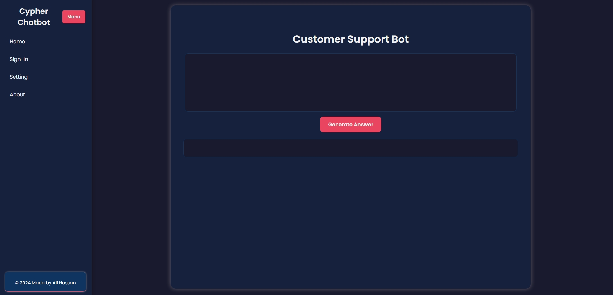

# Customer Support AI Chatbot

# [Ali Hassan](https://www.linkedin.com/in/ali-hassan-08b306226)

This repository contains a customer support AI chatbot developed using the Gemini API. The chatbot provides dynamic responses and interactive content to enhance customer support experiences.

## Features

- **Advanced Formatting:** Utilizes dynamic formatting to present code, text, and bullet points effectively.
- **API Integration:** Connects to the Gemini API to generate responses and handle customer inquiries.
- **Interactive Content:** Provides interactive and informative content based on user queries.

## Youtube Video Link

  [Chatbot-AI](https://youtu.be/iHPXzUcrwE0)

## Pictures

  

## Getting Started

### Prerequisites

Ensure you have the following installed:

- [Node.js](https://nodejs.org/) (version 14 or higher)
- [npm](https://www.npmjs.com/) (comes with Node.js)
- [Git](https://git-scm.com/)

### Installation

1. **Clone the repository:**

   ```bash
   git clone https://github.com/JIN-15/AI-Chatbot.git
   ```

2. **Navigate to the project directory:**

   ```bash
   cd customer-support-ai-chatbot
   ```

3. **Install dependencies:**

   ```bash
   npm install
   ```

4. **Create a `.env` file:**

   Copy the `.env.example` file to a new file named `.env` and add your Gemini API key:

   ```bash
   cp .env.example .env
   ```

   Edit the `.env` file and replace `YOUR_API_KEY` with your actual Gemini API key:

   ```env
   VITE_API_GENERATIVE_LANGUAGE_CLIENT=YOUR_API_KEY
   ```

5. **Start the application:**

   ```bash
   npm start
   ```

   The application should now be running at `http://localhost:3000`.

## Usage

- **Interacting with the Chatbot:** Type your queries or commands into the chatbot interface. The bot will process the input and provide responses based on its training and API integration.

- **API Integration:** The chatbot uses the Gemini API to generate responses. Ensure your API key is correctly set in the `.env` file.

## Contributing

Contributions are welcome! Please follow these steps to contribute:

1. **Fork the repository**

2. **Create a new branch:**

   ```bash
   git checkout -b feature/your-feature
   ```

3. **Commit your changes:**

   ```bash
   git commit -am 'Add new feature'
   ```

4. **Push to the branch:**

   ```bash
   git push origin feature/your-feature
   ```

5. **Create a pull request**
Creating a pull request involves several steps. Here’s a brief guide to help you understand the process:

### Creating a Pull Request

1. **Fork the Repository**

   If you don’t have write access to the original repository, you’ll need to fork it. On GitHub, navigate to the repository you want to contribute to and click the "Fork" button in the upper right corner.

2. **Clone Your Fork**

   Clone your forked repository to your local machine:

   ```bash
   git clone https://github.com/JIN-15/AI-Chatbot.git
   ```


3. **Create a New Branch**

   It’s a good practice to create a new branch for your changes:

   ```bash
   cd customer-support-ai-chatbot
   git checkout -b feature/your-feature
   ```

   Replace `feature/your-feature` with a descriptive name for your branch.

4. **Make Changes**

   Edit, add, or delete files as needed for your changes.

5. **Commit Your Changes**

   Stage your changes and commit them with a descriptive message:

   ```bash
   git add .
   git commit -m "Add description of your changes"
   ```

6. **Push to Your Fork**

   Push your changes to your forked repository:

   ```bash
   git push origin feature/your-feature
   ```

7. **Create a Pull Request**

   - Go to your repository on GitHub.
   - You should see a notification to create a pull request for your recently pushed branch. If not, navigate to the "Pull Requests" tab and click "New Pull Request."
   - Select the branch you just pushed and compare it to the branch you want to merge into (usually `main` or `master`).
   - Add a title and description for your pull request that explains your changes.
   - Click "Create Pull Request."

8. **Review and Discuss**

   - The repository maintainers and other contributors can review your pull request. They may suggest changes or request additional information.
   - You can discuss and address feedback directly in the pull request comments.

9. **Merge**

   - Once your pull request is reviewed and approved, it can be merged into the main branch of the original repository.
   - If you have permission, you can merge it yourself. Otherwise, the repository maintainers will handle the merge.

## Acknowledgments

- [Gemini API](https://generativelanguage.google/) for providing the generative language model.
- [React](https://reactjs.org/) for building the user interface.

## Contact

For any inquiries or feedback, please reach out to [hassanakramali@gmail.com](hassanakramali@gmail.com).
